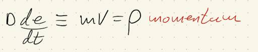

# Lab 4: Controlled actuation using PID

## Part 1: P Component

 When simply increasing the P variable, I felt a pull no matter where to the target position. When comparing the force to the arrow displayed on the sketch, the arrow seemed to lag behind the force feedbacks response. Also, when crossing an axis sign (-x to +x and vice versa), I can feel that the force exerted on the end effector is a cartesian force (which is the case as scene in the code). I would think that for situations like this where there is a target position, the force felt on the end effector should not be a pull to the target’s axial zero points and rather a force that pulls the end effector to it radially.
 
 
 
 When setting the P parameter to a very low value (0.01), force on the end effector is only felt at the very extreme bounds of the sketches space. At too high of a level (around 1 and above) aliasing issues occur resulting in oscillation. 
 
add video
 
 When changing the targets position, the device will move to the target at a speed proportionate to the P gain and if there is not enough damping applied to the force from holding the end effector, then it will start to oscillate. Because the change in the targets position is so quick, an issue seems to arise where the device will quickly move to the target, overshoot due to the amount of force it exerted then not stop at a certain distance. The distance from the target to which it stops may be due to the amount of force being exerted from the motors being equal to or lower than the friction force of the cursor on its surface and so at higher P levels that will not be an issue.
 
 add video
 
## Part 2: D Component

When adding the D component in, it is hard to notice the change, but I do feel as if my travel with the cursor is dampened or to be more specific the force I apply to the cursor is being dampened and this is due to the nature of the Derivative's equation. It minimizes the rate of change of the error. One other way to look at this from a physics standpoint is that it is minimizing the cursors velocity and that technically the equation is equivalent to the equation for momentum.

The smoothing is also important and by using the exponential smoothing equation, (in this case) higher amounts of smoothing results in the derivative value taking longer to change. Hence why at lower smoothing levels, problem arises where the pointer starts to glitch out and is felt through the pointer as almost noise. This can then cause oscillations if not damped appropriately.

Add video of the effect

## Part 3: I Component

The integral is exactly what the name states it takes the errors slope and finds the amount under its slope. Essentially acting as a running sum and is meant to help the desired device not stay within a steady state. In the case of the Haply, steady states arise within high friction/resistance zones. Through my testing, these zones are usually along the vertical axis of the haply as the haply's vertical force does not seem to be as strong as it's horizontal. As such when fully extended down the vertical axis or the cursor hits a high friction zone, it is put into a "steady state zone" where the force of the motors equals the force of resistance on the cursor.

add image of buffer issue 

When activating the I component I encountered an issue where there is always one area that seems to not exert force on the actuator. When diving into the code and printing out values I discovered that the cummerror values seem to be bugged and is what had been causing said issue in the simulation. At first, I thought it was integral windup, but because the calculation was being performed at start-up, the cursor and the targets position might not of been fully rendered and the cumerror value essentially blows and caused a buffer overflow issue. But out of Processing logic, that did not throw any errors in the terminal. So, to fix it I just had the value (cumerror) start being computed after nine to ten iterations of the loop.

Now, when I was finally able to get it working, I needed to implement some integral windup countermeasures. as the value is already constrained between -4 and 4, the optimisation lies within these bounds. So, whenever the cursor moved past the targets axis, I had the cummerror value reset to 0, which already drastically helped with the overshoot.

With that, I was able to create a semi stable system.

Add video 

## Part 4: Path Tracking
For this question, I ended up implementing a circular path for the target.

`float inc = TWO_PI/12.0;`

`float angle = 0;`

`float r = 0.5;`

`public void RandomPosition(int theValue) {
      xr = r*cos(angle);
      yr = r*sin(angle);
      angle += inc;
}`

While experimenting with the path tracking, I found that holding the handle stabilizes the motion of the cursor moving to the target and reduces potential oscillations. When not holding the handle the PID parameters needed to be lower so as to not overshoot, or glitch out. But whilst holding the handle, I can increase the PID values, creating a stronger response. But too hard and it gonks out.

Add video with hand held

without

## Part 5: Delays

Changing the sampling rate will change the rate at which the system responds to a change in the handle or targets position. Based on the Nyquist-Shannon sampling theorem, if the sampling frequency is too low then aliasing will occur folding whatever frequency that is past half the sampling rate over.

Add video

At a faster sampling rate, the overshooting is much smaller than at higher sampling rate. And what was previously properly tuned PID constants no longer works at a slower sampling rate.

When I have the loop time randomly change every x number of iterations, the movement becomes completely irregular making it impossible to tune. The only way to manage a device that has a varying sample rate and or aliasing that would create the same effect is to either have the PID constants be very low and or use a hand guided system to help mitigate the issues.

add video
