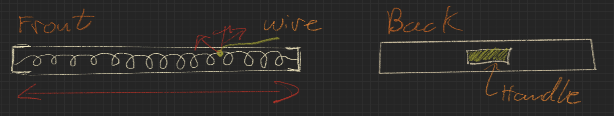

# CH-501_Max_Blog.github.io
This is a blog detailing my projects effectuated during the class CH-501.

## Sketches

Finger [here](https://maxw3llgm.github.io/CH-501_Max_Blog.github.io/sketches/Finger.html)

Press down [here](https://maxw3llgm.github.io/CH-501_Max_Blog.github.io/sketches/HandTool.html)

Shake it [here](https://maxw3llgm.github.io/CH-501_Max_Blog.github.io/sketches/Shaker.html)

