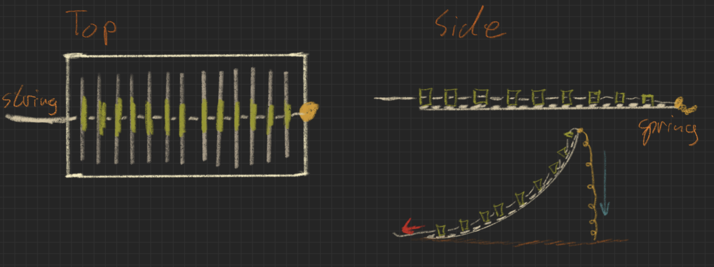
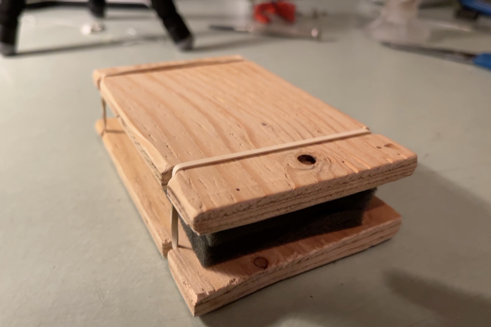

# CH-501_Max_Blog.github.io
This is a blog detailing my projects effectuated during the class CH-501.

## Sketches

Finger [here](https://maxw3llgm.github.io/CH-501_Max_Blog.github.io/sketches/Finger.html)

Press down [here](https://maxw3llgm.github.io/CH-501_Max_Blog.github.io/sketches/HandTool.html)

Shake it [here](https://maxw3llgm.github.io/CH-501_Max_Blog.github.io/sketches/Shaker.html)

## The Maze 

[here](https://maxw3llgm.github.io/CH-501_Max_Blog.github.io/Lab2/PinBallMaze.html)

[Code_Link](https://github.com/Maxw3llGM/CH-501_Max_Blog.github.io/tree/main/Lab2/Hello_Wall)

## Lab 3: Go By Feeling

[here](https://maxw3llgm.github.io/CH-501_Max_Blog.github.io/Lab3/Lab3.html)

[Code_Link](https://github.com/Maxw3llGM/CH-501_Max_Blog.github.io/tree/main/Lab3/version_2)
