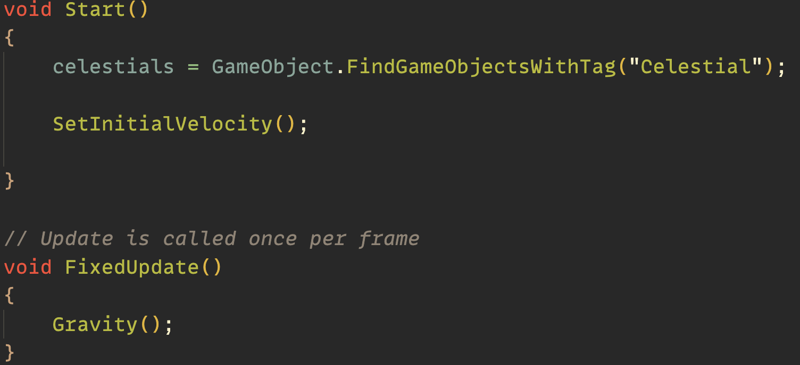

# Project Iteration 1

## Goal
For iteration one of my teams project, Anchit and I had as task to implement and demonstrate gravity. My goal was to implement a simple gravitational model within unity using the Haply framework. Anchit did the same but in Processing. 

Prior to this project I had no experience working in Unity or coding in C#. Given that, I knew that I had a few challenges in front of me in terms of getting started and, as extension, in understanding how the Haply framework functioned in Unity. 
 
## Achievements
* I was able to access, modify the proper variables and run the Unity sample projects with a working Haply. 

* I followed, with implementation, two tutorials on how to create solar systems in Unity. One was in 2D and the other in 3D. 

* Finally, I rudimentarily implemented the concepts seen in the 3D gravity tutorial within the Haply Framework. 

## Discussion
To my surprise, Unity's interface was intuitive enough for me to learn whilst setting up the Unity samples that were provided to use on the 2DiY Haply website. From them I learned of the project's file structure, the unity object hierarchy, and a faint idea of how the C# script files works. But I was glad to have gotten the samples working.

To learn more about Unity and how to implement gravity as a simulation, I chose to follow tutorials on how to create solar systems with simulated gravity. First, I chose a 2D variant tutorial but realized that the method used to have the planet orbit a star was to use the gravitational force and its derived velocity to find the planets next position. 

Curious to find a second opinion on the matter, I found another tutorial, this time in 3D, that implemented gravity in a more reliable way. In this case, to set the planet on either an elliptical or circular orbit, an initial velocity is set at the start of the simulation and then the resulting gravitational forces for each celestial body's rigibody component is calculated and applied during the simulation to maintain orbit. 

The tutorial also considered the notion that each celestial body acts upon one another and so in the simulation, the Star does move slightly in relation to the planet. This also is an added benefit as when simulating the travel of the ship in future iterations, all celestial bodies will be exerting force upon the ship at one time and thus must be considered. 

By following the tutorials I also gained new knowledge on how C# scripts interacts with the GameObjects within Unity. Contrary to how the Haply sample code works, scripts can access the gameobjects and technically "find" them based on their tags. So for future work where we are to have multiple celestial bodies, this would be beneficial as we would not need to manual link them to the script.

As our original intention for the project was to work in 2D, I took the time to implement the latest tutorial that was in 3D to work in 2D. I then worked to port it into a Haply sample project in which I encountered some challenges. Coming back to the sample project after following the tutorials, I better understood the structure of the script. For example, to have the haply receive properly timed updates, SimulationSteps is instantiated as a task. 

## Challenges

My first challenge was simply understanding how the Haply device interacted with Unity. I unfortunately bricked my haply by setting a baud rate in unity and had to reset and flash the firmware on the Haply device to get it functioning again.

Then given that I did not know much about Unity, when following the tutorials, I had to figure out how they were able to reference the scripts to the project. I figured quickly enough that scripts are to be added to GameObjects as scripts for them to work and that you can create [SerializeField] variables in code to link objects in Unity to the script.

My last and latest hurdle is in how to implement the gravity functions I made into the Haply code as I found that my GameObject List called "Celestials" does not play well with the SimulationStep function for a reason that I currently do not understand. I am actively looking into and discussing this matter with my peers. As a current solution however, I instead have the gravity simulation run on its own in a FixedUpdate loop and have the SimulationSteps function read the force variable whenever it starts and have that value be transmitted to the haply. This might not be the most efficient method, but it works for now.

## Future Steps

Now that I understand the inner workings of Unity, simulating gravity and C#, I will work towards implementing with Anchit a better way of interacting with gravity on the Haply and to combine what we both have done to create a basic implementation of the game's spaceship.
