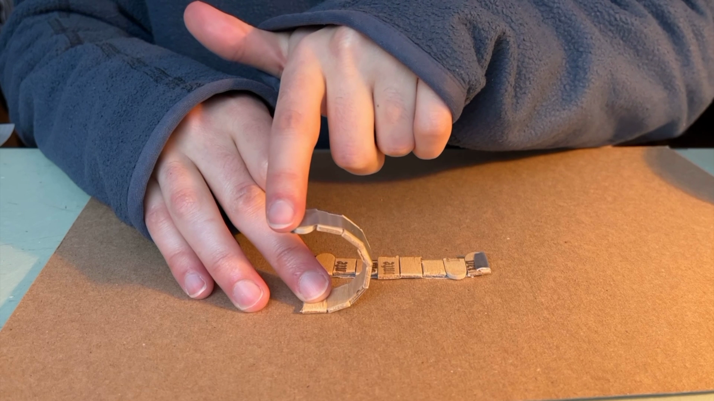
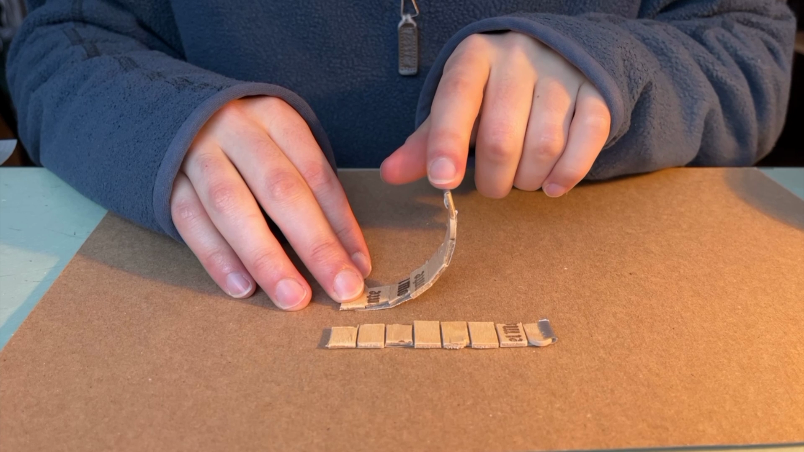

## Finger

The goal was to create a simple device that when actuated with a string with flex upward and utilise gravity and tension in order to spring back and slap the ground serving as a simple actuator or percussive tool.

First I tested what medium should the pieces be glued onto, at first I chose a paper but eventually went for the sakes of efficiency with a ducktape base. Then I tested the use case of having duck tape on both sides.

This let to the dissadvantage of having that second piece of tape be a detriment and actutally prevent the piece from flexing properly. As a result I stuck with only once side of tape. 

After that I added a set of popsicle stick spines and tested with the gap between the pieces which led to conclude two things. Larger the gap further will the piece be able to flex but has the tradeoff reducing the tension and this the spring back effect.
 

A future solution if greater levels of flex is needed would be to divide the equivilent angular displacement that the gap would permit into smaller equivelent pieces. like that the angle between the pieces are smaller and will maintain the tensions of the device when it flexes. 

Next, I added a guide for a string as a tool to flex the device by pulling on it.

The resulting device is a finger like device that can in future iterations be connected to a motor to actuate it. 

Future Improvements woudl be to add a spring system to increase the potential force of the device and have it spring back quicker. Methods were already tested however the spin if subjected to too high a pull force from the spring will flex at a different point in the spin creating an undersireable kink and potentially breaking it. As a fix, potentially adding a reinforcement to the spine structure like a compressable medium like silicon in the gaps might help. 
