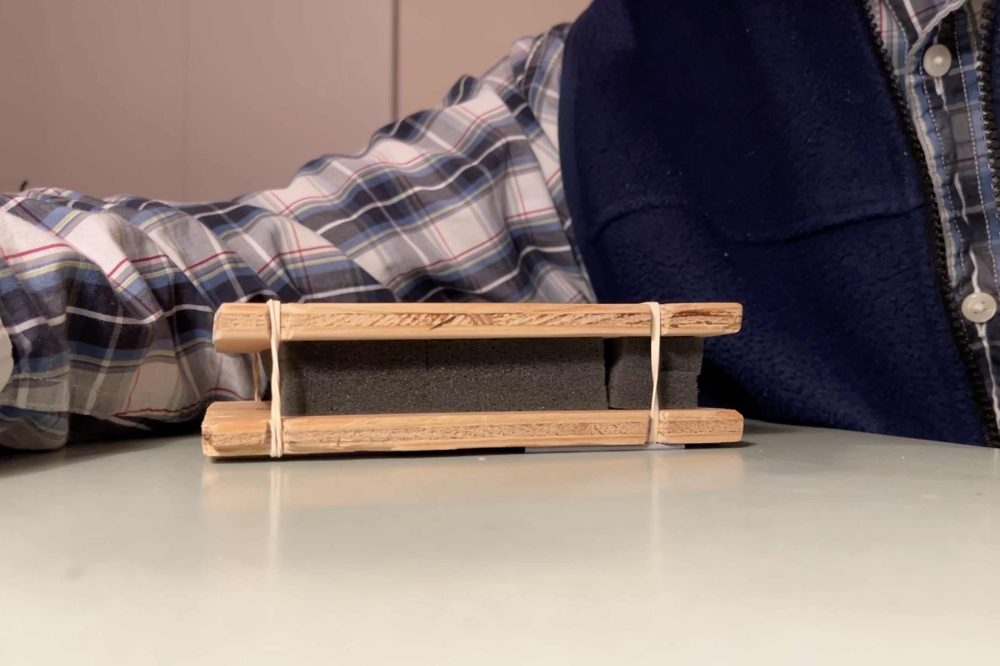

## HandTool

My second sketch, inspired by the Touche from espressivee is a surface that that you lie flat your hand on and push, tilt and shake.

The goal was to create a surface that can  interact with the entire hand on the level of 10 mm.

I built this device using packaging foam in the center, with 4 spring embeded on each corner for added support, sandwiched between two pieces of ply wood and held down using two springs held in place with notches in the wood.

In the video I demonstrate how it would be used. Notably so, It would be interesting to give feedback to the user about what is happening in software by mechanically tilting the surface a force feedback and potentially have it be a vibrotactile surface to allow for more nuanced feedback. That is why I use my other hand to push up on the wood.

